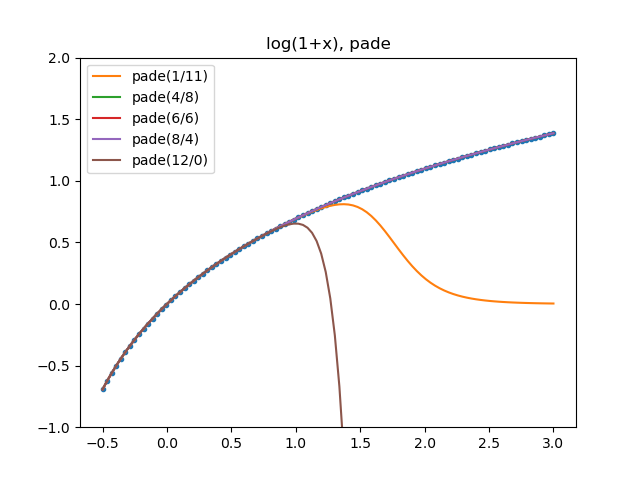
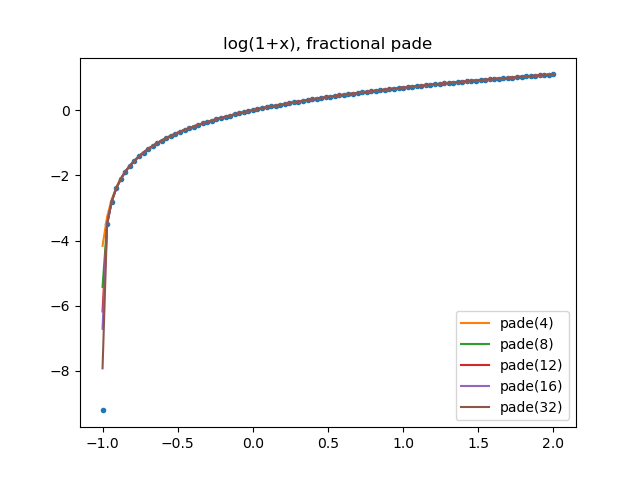
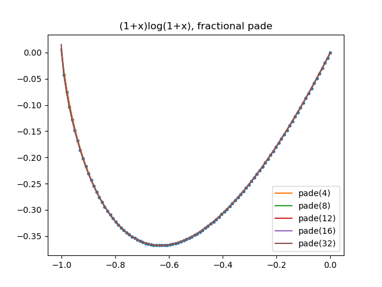
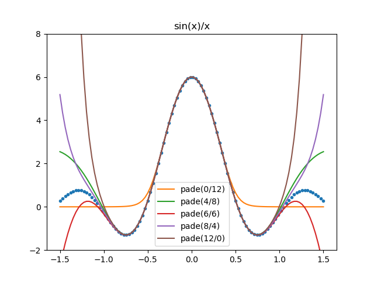

# Matrix Logarithm and Frechet derivative

Pytorch version of `scipy.linalg.sqrtm` and `scipy.linalg.logm` and their backward derivative.

1. link
   * computing the Frechet derivative of the matrix logarithm and estimating the condition number [link](https://epubs.siam.org/doi/10.1137/120885991)
   * [github/matrix-sqrt](https://github.com/msubhransu/matrix-sqrt)
   * [wiki/sylvester-equation](https://en.wikipedia.org/wiki/Sylvester_equation)
   * [github/pytorch/issue/sqrtm](https://github.com/pytorch/pytorch/issues/25481)
   * [github/pytorch/issue/schur-decomposition](https://github.com/pytorch/pytorch/issues/78809)
   * [github/pytorch/issue/logm](https://github.com/pytorch/pytorch/issues/9983)
2. current limitations
   * only CPU, no GPU support: we use `scipy.linalg.sqrtm` in the implementation
   * no batch support: please use for-loop
   * performance issue: we simply implement the most **naive** version (algorithm-2.1) from the paper

usage

```python
import numpy as np
import torch
from utils import TorchMatrixLogm
tmp0 = np.random.randn(3,3) + 1j*np.random.randn(3,3)
tmp1 = np.random.randn(3,3) + 1j*np.random.randn(3,3)
op_logm = TorchMatrixLogm(num_sqrtm=8, pade_order=8)
torch0 = torch.tensor(tmp0+tmp0.T.conj(), dtype=torch.complex128, requires_grad=True)
torch1 = torch.tensor(tmp1, dtype=torch.complex128)
loss = torch.sum(op_logm(torch0)*torch1).real
loss.backward()
print(torch0.grad)
```

```python
tensor([[ 0.0598-0.0741j, -0.0784-0.4665j, -0.0907+0.0984j],
        [ 0.2240-0.2372j,  0.8684-0.2573j,  0.8562+2.5352j],
        [ 0.5691+0.2070j,  1.6322+0.4020j, -0.2854-0.1793j]],
       dtype=torch.complex128)
```

unitest: fail sometimes. The converged accuracy is not enough for that randomly-generated matrix. If you do care about the accuracy, we should increase the parameter `pade_order` (usually `6-8` is good enough) and `num_sqrtm` (usually `6-10` is good enough).

```bash
pytest .
```

## Pade approximation








